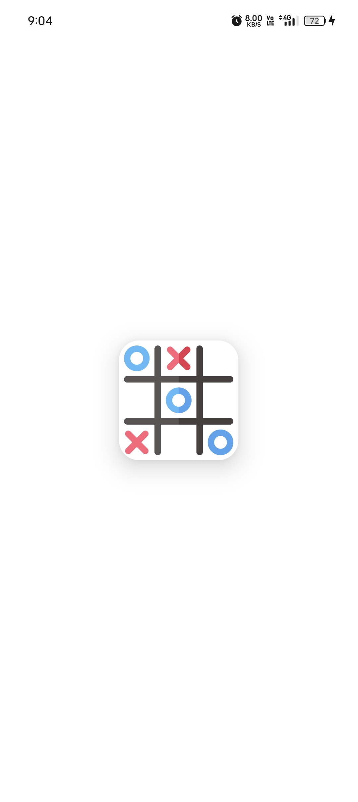
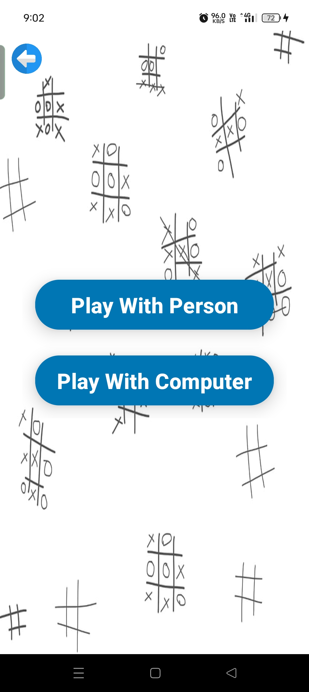
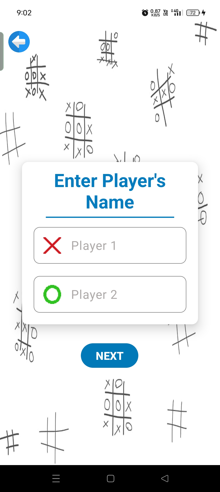
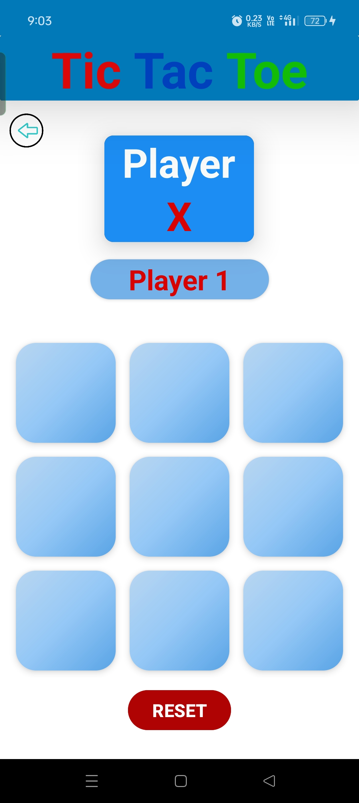
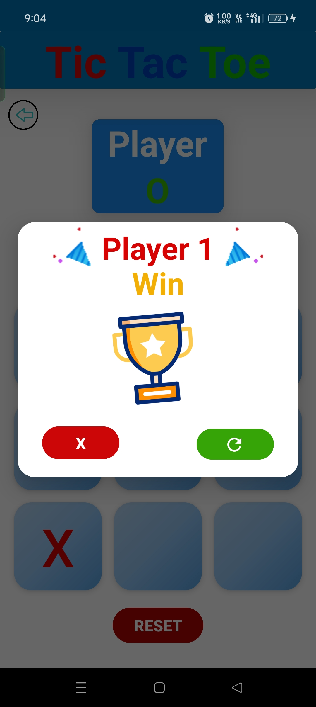
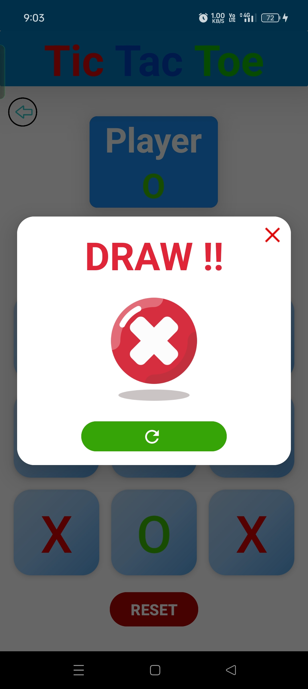

# 🎮 Tic Tac Toe - Android Game

A beautifully designed and interactive **Tic Tac Toe** game built using **Kotlin** and **XML**, with future plans for **Jetpack Compose** integration. Supports both **Player vs Player** and **Player vs Computer** gameplay modes with animations and sound effects.

---

## ✨ Features

- 👥 **Play with Friend (2 Player Mode)**
- 🤖 **Play with Computer (AI Mode)**
- 🔊 **Engaging sound effects**
- 🎨 **Smooth graphics and fun animations**
- 🔁 **Reset game** any time
- 🎉 **Win/Draw detection** with visual feedback

---

## 🛠 Tech Stack

- **Language:** Kotlin
- **UI:** XML
- **IDE:** Android Studio
- **Architecture:** Simple, clean code structure (MVVM planned)

---

## 📱 Screens Overview

1. **Home Screen**
    - Choose: `Play with Person` or `Play with Computer`

2. **Player Details Screen**
    - Input player names (for 2-player mode)

3. **Game Screen**
    - Interactive 3x3 board with animations
    - Reset button
    - Displays result with animations

---

## 📸 Screenshots

<p align="center">
  
  
  
</p>

<p align="center"><i>Loading Screen &nbsp;&nbsp;&nbsp;|&nbsp;&nbsp;&nbsp; Choose Person or Computer &nbsp;&nbsp;&nbsp;|&nbsp;&nbsp;&nbsp; Players' Name</i></p>

<p align="center">
  
  
  
</p>

<p align="center"><i>Game Screen &nbsp;&nbsp;&nbsp;|&nbsp;&nbsp;&nbsp; Draw Animation &nbsp;&nbsp;&nbsp;|&nbsp;&nbsp;&nbsp; Win Animation</i></p>


---

## 📲 Available on Google Play

The game is live on the **Google Play Store**!  
Click below to download and play:

<p align="left">
  <a href="https://play.google.com/store/apps/details?id=com.monotoshghosh.tictactoe">
    
  </a>
</p>

---

## ▶️ Getting Started

### 1. Clone the Repository

```bash
git clone https://github.com/monotoshghosh/Tic-Tac-Toe.git
```
### 2. Open in Android Studio

- Open the project from the cloned directory.
- Let **Gradle sync**.
- Connect your **Android device** or launch an **emulator**.
- Run the app and start playing!

---

## 📄 License

This project is licensed under the **MIT License**.  
See the [LICENSE](LICENSE) file for details.

---

## 🤝 Contributing

Contributions are welcome!  
Feel free to **fork the repository**, **submit issues**, and **open pull requests**.

---

## 👨‍💻 Developer

### Made with ❤️ by Monotosh
*– Stay Happy 😊*

---
